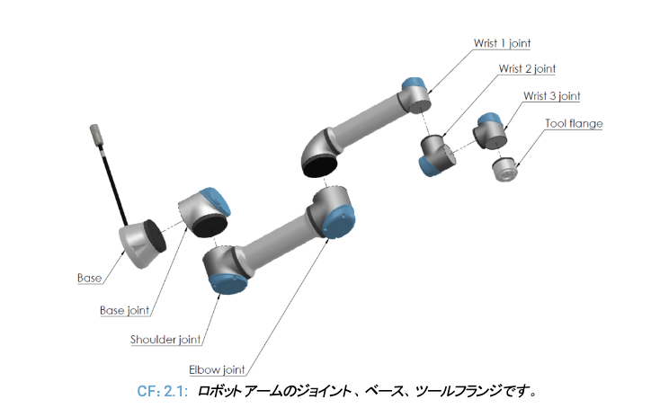

- 関節を初期位置からペンを下ろすようにする
- 座標変換システムを私が理解する。markerからtransformを使う形式に全部変更する？
- ctrl Cで一度に終了できるようにする
KeyboardInterrupt: 
QObject::killTimer: Timers cannot be stopped from another thread
QObject::~QObject: Timers cannot be stopped from another thread
ubuntu@908254c6efeb:/workspace/robot/demos/phase1$ 

- RvizViewNodeで、ロボットの動作のpublishも行う？
    - ペン位置とのズレがあって気持ち悪い　vs. シミュレーション結果
    - そもそも同期してpublishするべきなのかも

- 姿勢の制約
    - tool flange が地面に常に向かったまま関節を制御？
  

- 座標系
    - base_link
    - shoulder_link->
    - canvas

- 座標系の大混乱を収める